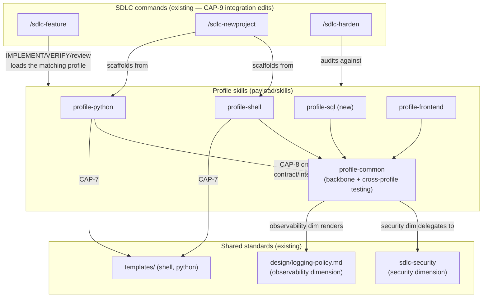

# Architecture Overview — Profile Skills

> Produced by `/sdlc-architecture` from the approved `discovery/concept.md` +
> `discovery/use-cases.md`. Curated, not exhaustive. Traceability rule: every
> capability names the use-case IDs it serves; every component below is built
> from ≥1 capability, and every use case is served by ≥1 capability (no floats).

## 1. Capability map (approved at Gate 1)

Per-profile, per-dimension (each realized ×4 profiles: shell · python · sql · frontend):

| Cap | Capability | Serves UC |
|---|---|---|
| CAP-1 | Best-practice standard + lint/format tooling | UC-001, UC-008 |
| CAP-2 | Testing standard across the pyramid + runner | UC-002 |
| CAP-3 | Security checklist + scanner | UC-003 |
| CAP-4 | Performance & scale signals + tooling | UC-004 |
| CAP-5 | Reliability & resilience standard | UC-010 |
| CAP-6 | Observability & logging standard | UC-009 |

Content-kind & cross-cutting:

| Cap | Capability | Serves UC |
|---|---|---|
| CAP-7 | Scaffolding templates (shell + python only) | UC-005 |
| CAP-8 | Cross-profile contract/integration/e2e testing | UC-007 |
| CAP-9 | Command integration (profiles applied at gates) | UC-001–006, 009, 010 |
| CAP-10 | `profile-common` backbone + consistent `SKILL.md` structure *(AI-proposed, approved)* | UC-008 + coherence across all |
| CAP-11 | Pilot profile built first as the reference pattern *(AI-proposed, approved)* | sequencing device |

## 2. Components

The system is a set of **skills** (+ template dirs) in the `payload/`, consumed by
the existing SDLC commands. No runtime service — everything is prose+tooling an
agent loads.

| Component | New/existing | Built from | Owns |
|---|---|---|---|
| **`profile-common`** (skill) | **new** | CAP-10, CAP-8 | The `SKILL.md` structure every profile follows; the 6-dimension convention (ADR-0001, amended #89 — Observability is its own dimension); the **cross-profile testing** guidance (CAP-8); pointers to shared policies (`sdlc-security`, `design/logging-policy.md`). Backbone — mirrors `sdlc-common`. |
| **`profile-shell`** (skill) | enhance existing dir | CAP-1–7 | Shell rendering of all 6 dimensions + scaffolding (CAP-7). References shipped shell skills (non-goal: don't absorb them). |
| **`profile-python`** (skill) | enhance existing dir | CAP-1–7 | Python rendering of all 6 dimensions + scaffolding (CAP-7). |
| **`profile-sql`** (skill) | **new (greenfield)** | CAP-1–6 | SQL rendering of all 6 dimensions (no CAP-7 scaffolding). |
| **`profile-frontend`** (skill) | enhance existing dir | CAP-1–6 | Frontend rendering of all 6 dimensions (no CAP-7 scaffolding). |
| **Command integration** | edit existing | CAP-9 | `/sdlc-feature`, `/sdlc-newproject`, `/sdlc-harden`, `sdlc-common` load & apply the profile at the right gates. |
| **`templates/`** (dirs) | existing, aligned | CAP-7 | Scaffolding for shell/python, aligned to the new standards. |

## 3. Container diagram (C4-ish)

**Reading it:** commands load `profile-<stack>` at their gates; every profile sits
on the `profile-common` backbone; the security & observability dimensions reuse
existing shared standards rather than re-inventing them; cross-profile testing
(CAP-8) is owned by `profile-common` because it spans multiple profiles by nature.

## 4. Nothing floats (architecture gate check)

Every UC → ≥1 capability → a component:
- UC-001→CAP-1, UC-002→CAP-2, UC-003→CAP-3, UC-004→CAP-4, UC-005→CAP-7,
  UC-006→CAP-9, UC-007→CAP-8, UC-008→CAP-1/CAP-10, UC-009→CAP-6, UC-010→CAP-5.
- No capability lacks a UC; no UC lacks a capability.

## 5. Open questions → ADRs (Gate 3)

Carried from discovery, to be decided as decision records:
1. **What makes "performance & scalability" checkable** per stack? (CAP-4)
2. **Where cross-profile e2e lives and how it's driven** (CAP-8) — in
   `profile-common`? a dedicated lane? one `test.sh`?
3. **Scaffolding (CAP-7) vs existing `templates/` and `/sdlc-newproject`** — extend
   or reference?
4. **Profile `SKILL.md` structure** (CAP-10) — the shared shape, and how the
   security dimension folds in the in-flight #84/85/86.
